# terraform
## This is a process of excuting a terraform script from the terminal using the terraforn process, which are; 
- initial
- validate
- plan
- apply
- destroy
## Using aws cloud services.
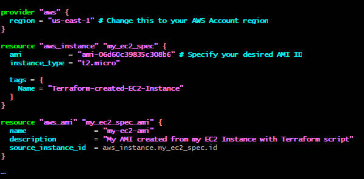

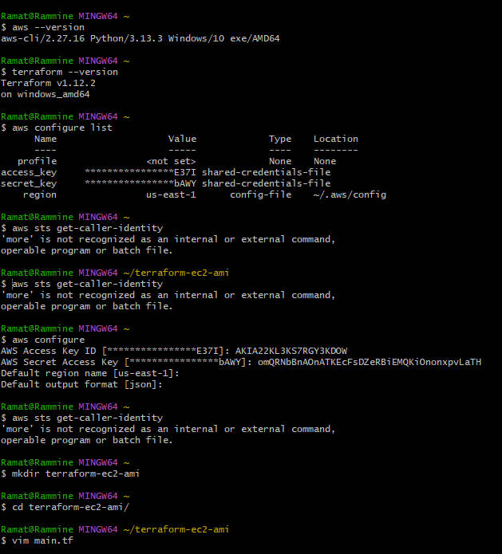

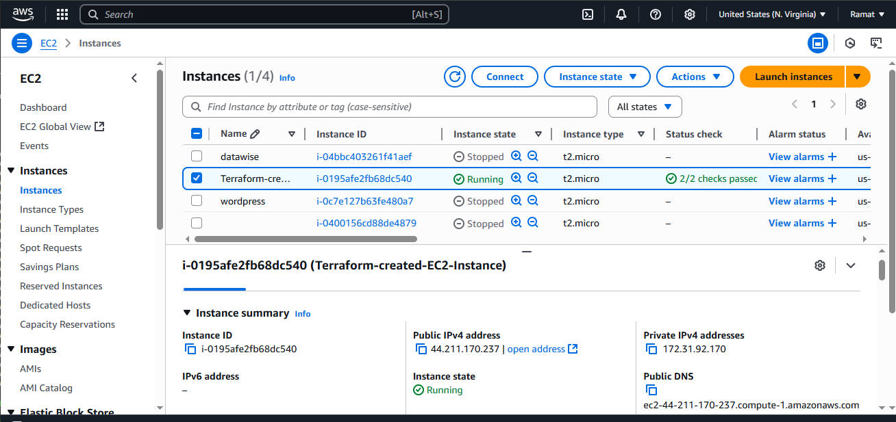

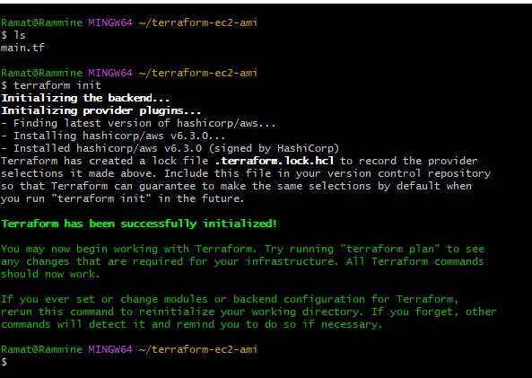

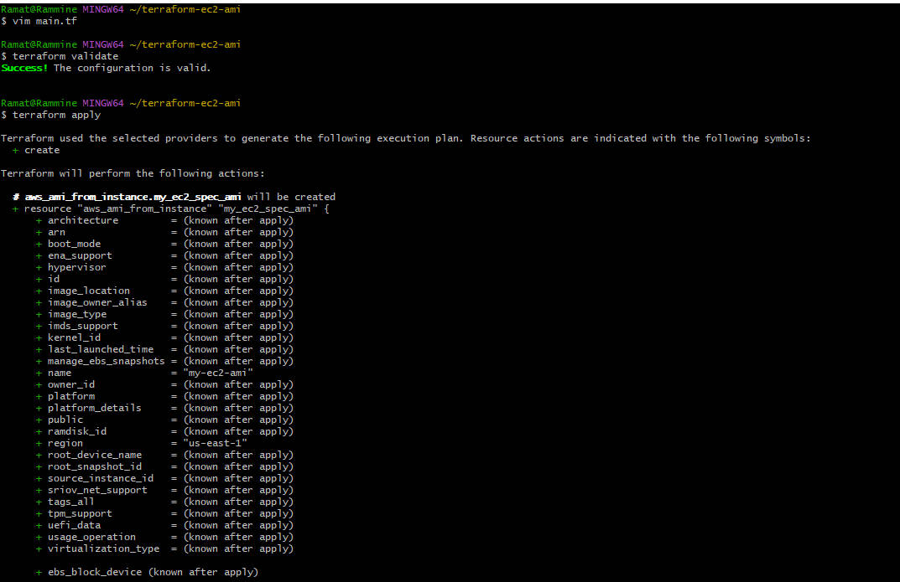

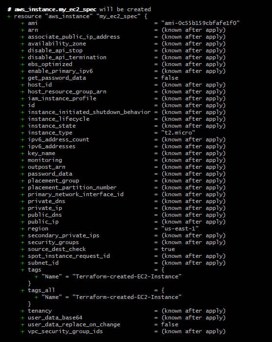

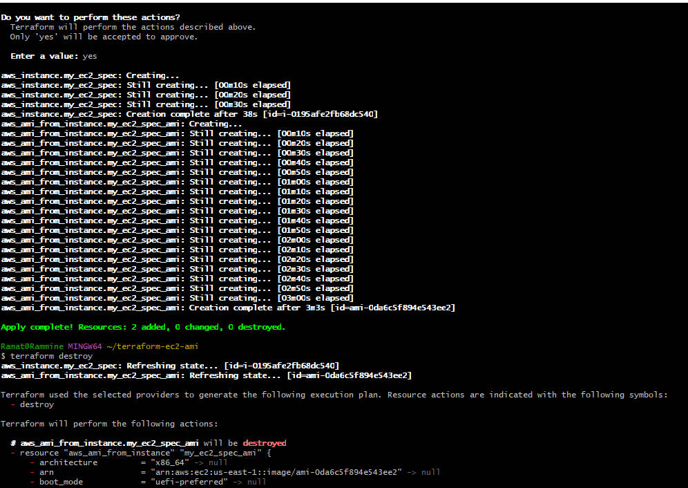

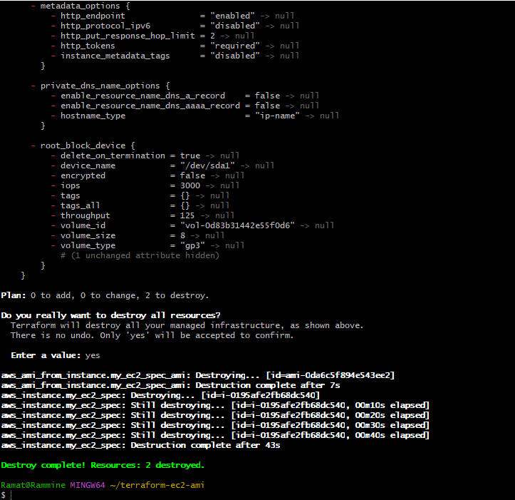

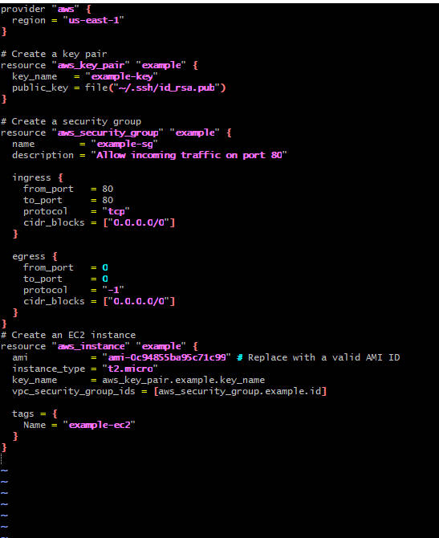

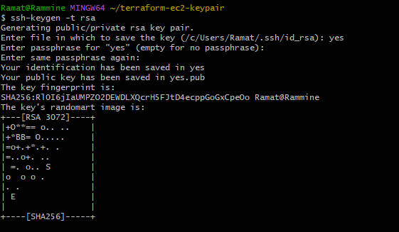

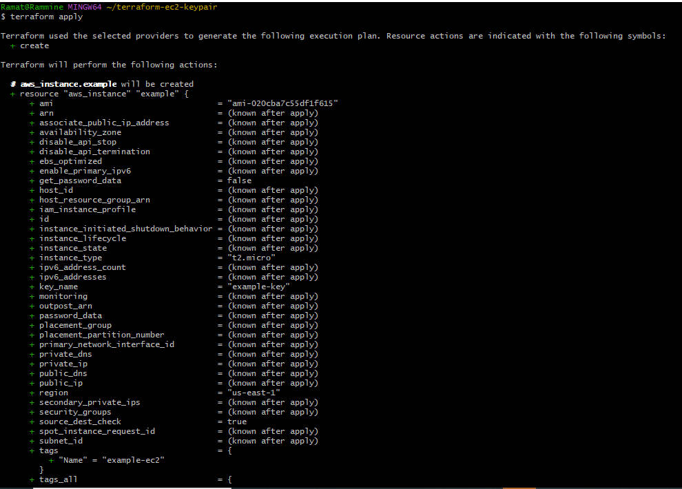

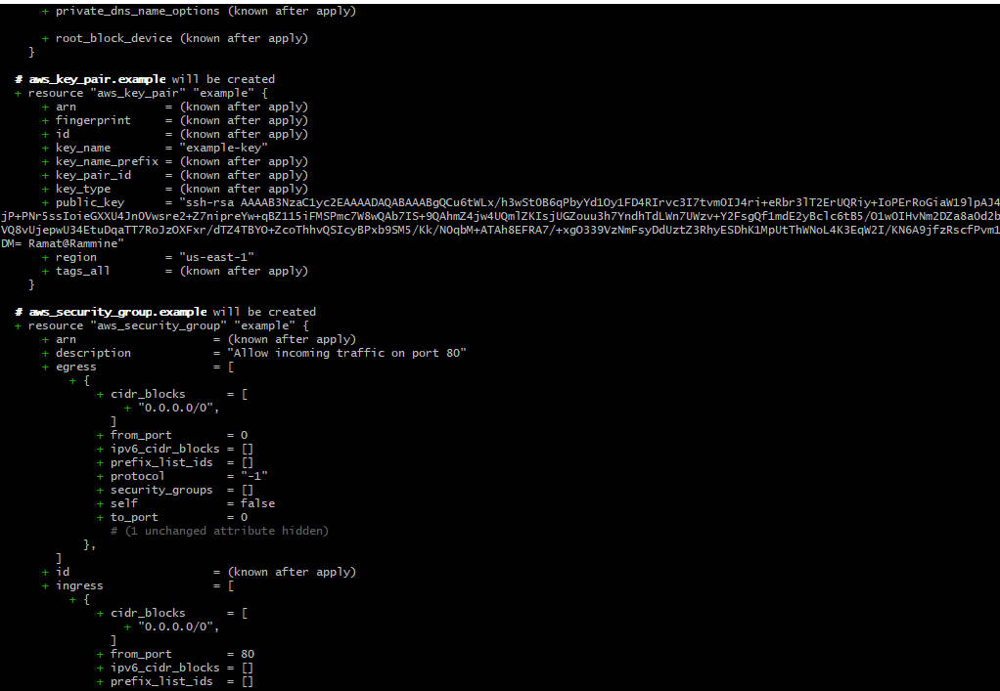

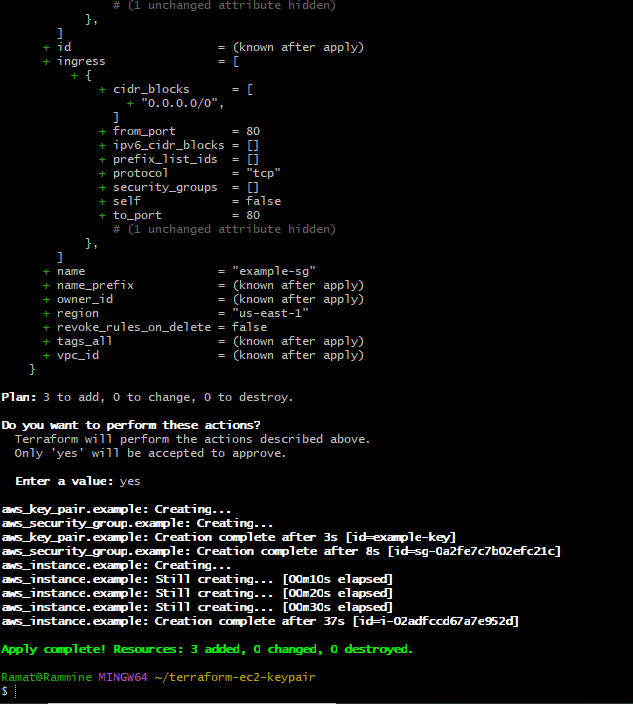

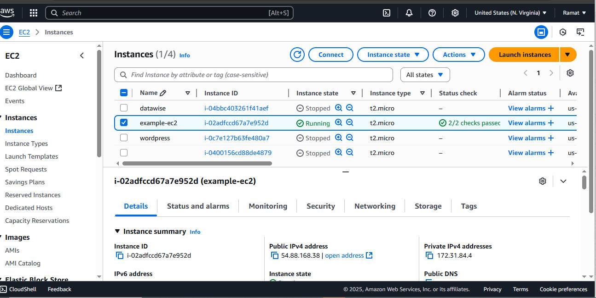

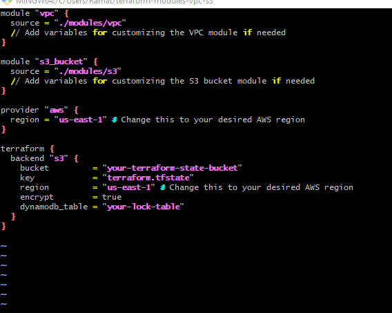

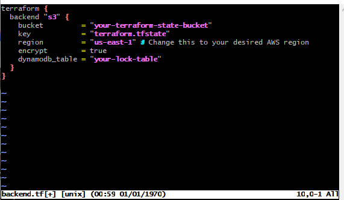

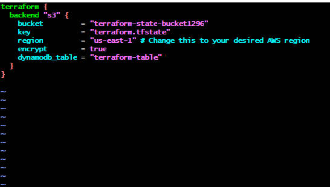

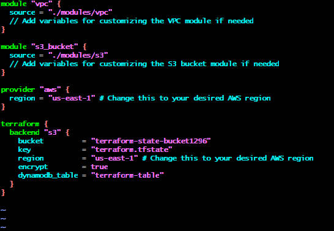

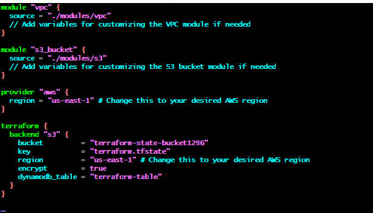

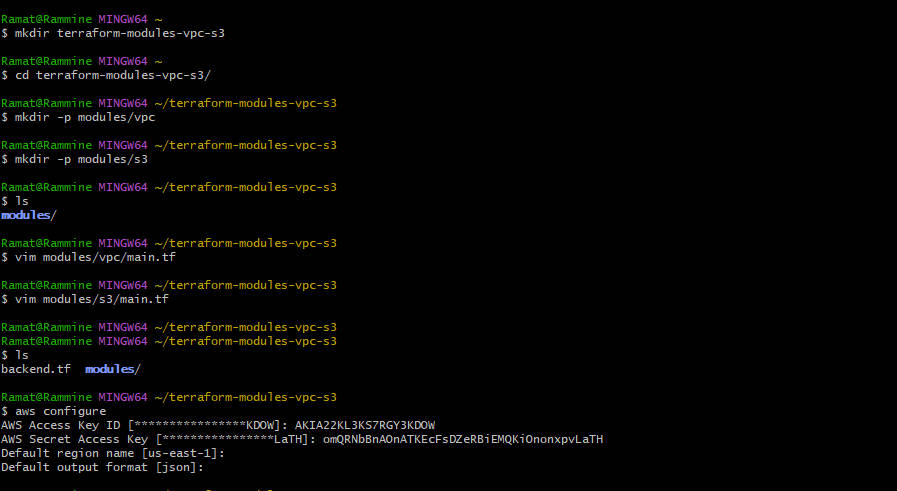

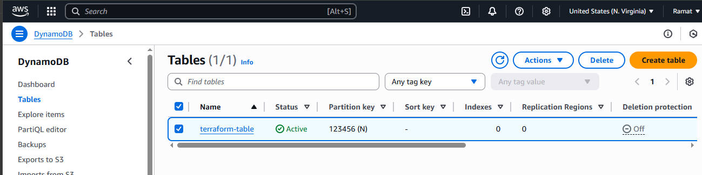

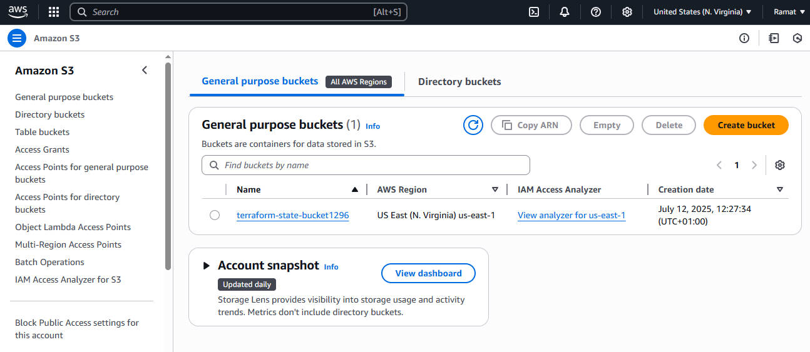

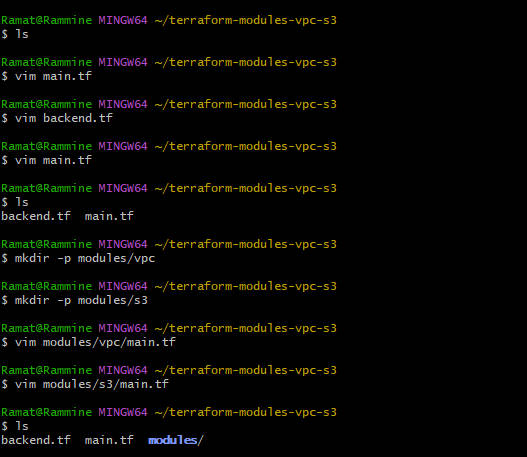

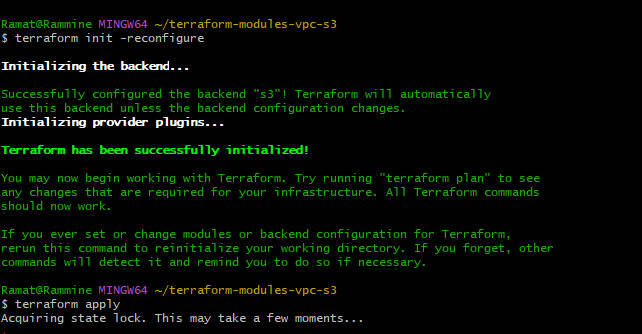

